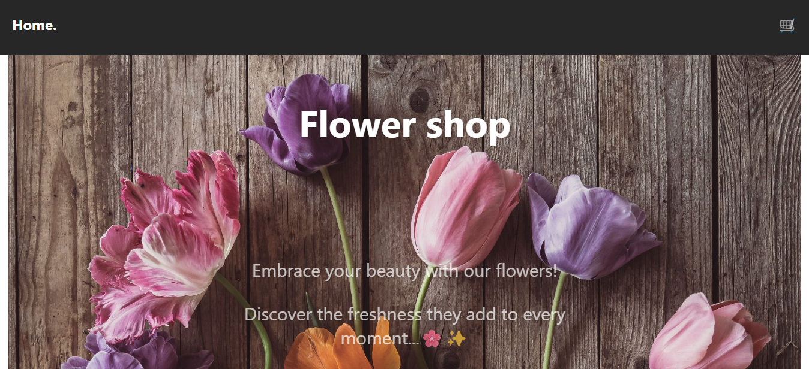
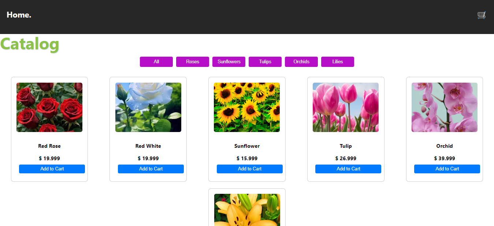
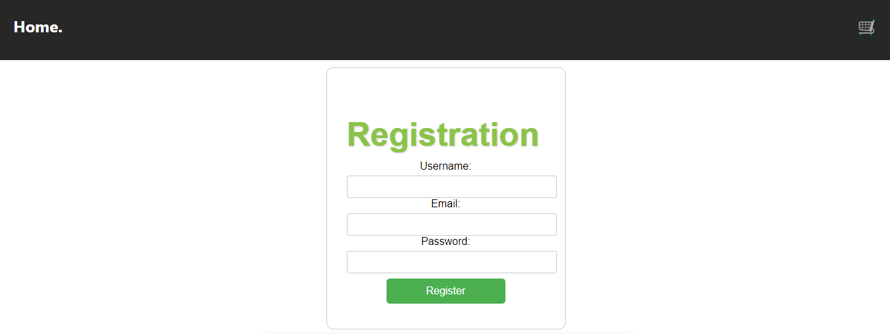
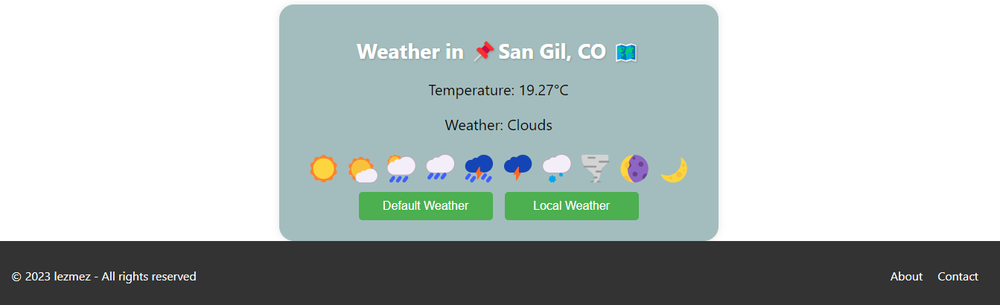

# ¡ Welcome to my application created with React !

I'd like to invite you to explore my webpage where you can find an amazing variety of products. Take a look here. Also, you can check out my code on GitHub here! 🌸✨
* https://github.com/lezmez/react-floristeria.git

## Requirements

### Install

* npm i react-router-dom
* npm i axios

## Built with 🛠️
The following technologies and tools were used in creating the site:

- Technologies:

    
    
    

- Tools (Free):
    - [Visual Studio Code](https://code.visualstudio.com/) --> Editor de texto.

## Author(s) ✒️

This site was created by:

* **Cristian David Lesmes**
* **Jeffer Fabian Pinzon**

## Available Scripts

In the project directory, you can run:

### `npm start`

Runs the app in the development mode.\
Open [http://localhost:3000](http://localhost:3000) to view it in your browser.

The page will reload when you make changes.\
You may also see any lint errors in the console.
